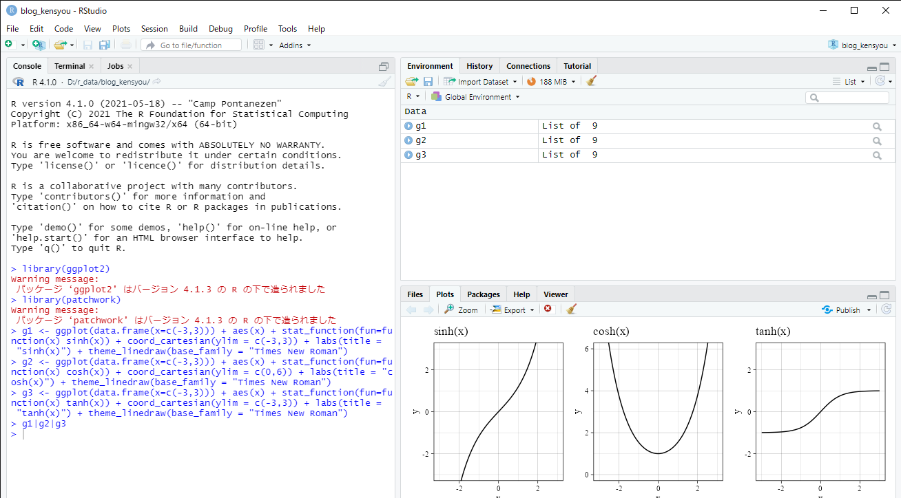
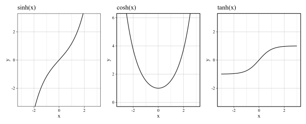
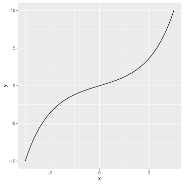
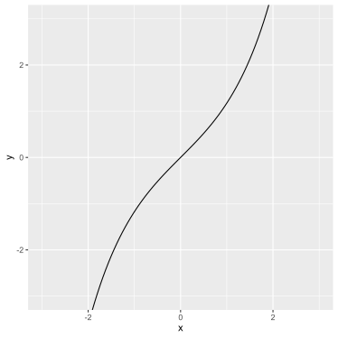
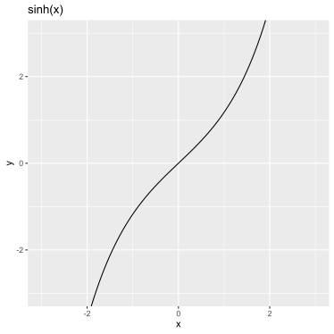
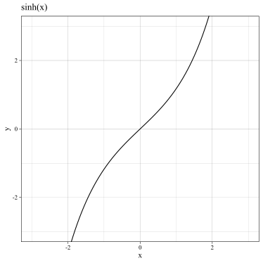
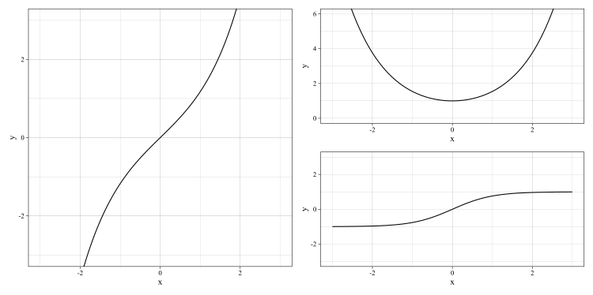

これは[工研ブログリレー2022](https://gotti.dev/post/koken_blog_relay_2022_index/)の10日目の記事です。
9日の記事はもっちゃんさんの[電気通信大学で生き残るための序盤の布石](https://mocchan.dev/koken/koken-blog-relay-2022-day9/)です。UECサバイバルでのテクニックが書いてあるのでぜひご一読を。

さて、私は最近[微積分で覚えるといいかもしれない公式など](https://kienn-hcl.github.io/mysite/posts/bisekimemo/)というのを書いたのですが、そこで関数のグラフを描くのにRを使ってみたのでそのことについて書いていこうと思います。なぜRを使ったのかというと、なんとなくです。特に理由はないですね。

[3日目](https://ta729ip.github.io/ta729ip_blog/posts/koken-relay/)の記事と若干ネタ被りしちゃいました...ごめんなさい...

ちなみに筆者はR初心者なので何か間違ってることなどがあったらTwitterなどで連絡してくださるとうれしいです。

## やったことの要約
Rと統合開発環境であるRStudioはインストール済みであることを想定しています。
RStudio上で以下を入力していく。

~~~R
install.packages("tidyverse") #以前一回でも実行したことがあるのなら不要
library(ggplot2) #library(tidyverse) でもよい
library(patchwork) #複数のグラフを並べて表示する用

g1 <- ggplot(data.frame(x=c(-3,3))) + aes(x) + stat_function(fun=function(x) sinh(x)) + coord_cartesian(ylim = c(-3,3)) + labs(title = "sinh(x)") + theme_linedraw(base_family = "Times New Roman")
g2 <- ggplot(data.frame(x=c(-3,3))) + aes(x) + stat_function(fun=function(x) cosh(x)) + coord_cartesian(ylim = c(0,6)) + labs(title = "cosh(x)") + theme_linedraw(base_family = "Times New Roman")
g3 <- ggplot(data.frame(x=c(-3,3))) + aes(x) + stat_function(fun=function(x) tanh(x)) + coord_cartesian(ylim = c(-3,3)) + labs(title = "tanh(x)") + theme_linedraw(base_family = "Times New Roman")

g1|g2|g3
~~~

※そのままでも問題ないかもしれませんが、グラフの表示のためにRStudioのメニューから「Tools」→「Global Options」を押して「General」内の「Graphics」でBacendをAGGにしておくとよいかもしれません。

以下のような画面になっているはず。

右下のグラフが表示されているところにあるExportからSave as imageを選ぶとグラフの画像を保存できます。

## ggplot2パッケージについて

今回グラフを作っていくにあたってggplot2というパッケージを使いました。このggplot2というのは関数の結果を1つずつ+演算子によってレイヤとして重ねていくという文法をとるようです。上でも「gplot(...) + aes(...) + ... 」となってますね。上でできたグラフにさらにいろいろしたいときには+で関数を足せばよさそうです。

それぞれの関数についてちょこっとだけ説明を書いときます。

### ggplot(...)
この関数でグラフに使うデータフレームを指定します。

### aes(...)
データフレームから列を選びx軸やy軸に割り当てます。

### stat_function(...)
fun=で関数を指定することができます。

~~~R
ggplot(data.frame(x=c(-3,3))) + aes(x) + stat_function(fun=function(x) sinh(x))
~~~
という風にすると以下のようなグラフになります。

### coord_cartesian(...)
表示範囲を制限することができます。

~~~R
ggplot(data.frame(x=c(-3,3))) + aes(x) + stat_function(fun=function(x) sinh(x)) + coord_cartesian(ylim = c(-3,3))
~~~

### labs(...)
軸のラベルを変更したりタイトルを設定したりできます。

~~~R
ggplot(data.frame(x=c(-3,3))) + aes(x) + stat_function(fun=function(x) sinh(x)) + coord_cartesian(ylim = c(-3,3)) + labs(title = "sinh(x)")
~~~

### theme_linedraw(...)
これはtheme関数群というものの一つで他にtheme_grayやtheme_classicというのがあり、グラフの見た目を変えることができます。グラフ内のフォントを変更することもできます。

~~~R
ggplot(data.frame(x=c(-3,3))) + aes(x) + stat_function(fun=function(x) sinh(x)) + coord_cartesian(ylim = c(-3,3)) + labs(title = "sinh(x)") + theme_linedraw(base_family = "Times New Roman")
~~~

## patchworkパッケージについて

このpatchworkパッケージというのを使うことによって複数のグラフを並べて出力することができます。

上にでは「g1|g2|g3」としていましたが、「g1|(g2/g3)」とすると次のようになります。

## おわりに

ということでRで関数のグラフを描きました。+で関数をつなげていくだけで結構きれいなグラフが作れるのはなかなか良いと思います。

特に1年次は~~悪しき~~実験Aでグラフについても厳しく指摘されたりするでしょう。グラフ作成の手段としてRを選択肢に入れてみてはどうでしょうか？

