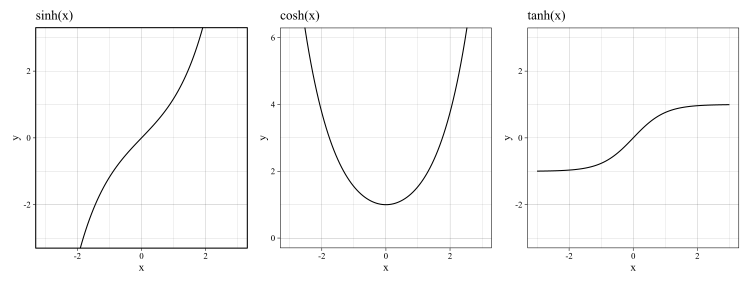

私が微分積分学での中間試験で覚えといて役に立ったものをメモとして残しときます。

間違いがあるかもしれないので各自の責任で持ってご活用ください。また、もし間違いを見つけた人がいたら私のtwitterなどに連絡をくれるとありがたいです。

- - - 

$$(x^x)^{\prime} = x^x(\log x +1)\\\\[22pt]$$

$$
\begin{align*}
(\sin^{-1} x)^{\prime} &= \frac{1}{\sqrt{1-x^2}}\\\\[11pt]
(\cos^{-1} x)^{\prime} &= -\frac{1}{\sqrt{1-x^2}}\\\\[11pt]
(\tan^{-1} x)^{\prime} &= \frac{1}{1+x^2}
\end{align*}
$$

- - - 

$$\cos(\sin^{-1} x) = \sin(\cos^{-1} x) = \sqrt{1-x^2}$$

$$\tan(\sin^{-1} x) = \frac{\sin(\sin^{-1} x)}{\cos(\sin^{-1} x)} = \frac{x}{\sqrt{1-x^2}}$$

$$\tan(\cos^{-1} x) = \frac{\sin(\cos^{-1} x)}{\cos(\cos^{-1} x)} = \frac{\sqrt{1-x^2}}{x}$$

- - -

$$\cos(\tan^{-1} x)=\frac{1}{\sqrt{1+x^2}}$$

$$\sin(\tan^{-1} x) = \tan(\tan^{-1} x) \cdot \cos(\tan^{-1} x) = \frac{x}{\sqrt{1+x^2}}$$

- - -

$$(\tan x)^{\prime} = \frac{1}{\cos^2 x}$$

$$\left(\frac{1}{\tan x}\right)^{\prime} = -\frac{1}{\sin^2 x}$$

- - -

$$
\begin{align*}
\sinh x &= \frac{e^x - e^{-x}}{2}\\\\[11pt]
\cosh x &= \frac{e^x + e^{-x}}{2}\\\\[11pt]
\tanh x &= \frac{\sinh x}{\cosh x}\\\\[22pt]
\end{align*}
$$

$$
\begin{align*}
(\sinh x)^{\prime} &= \cosh x\\\\[11pt]
(\cosh x)^{\prime} &= \sinh x\\\\[11pt]
(\tanh x)^{\prime} &= \frac{1}{\cosh^2 x}\\\\[22pt]
\end{align*}
$$

$$\cosh^2 x - \sinh^2 x = 1$$

- - -

※座標に注意