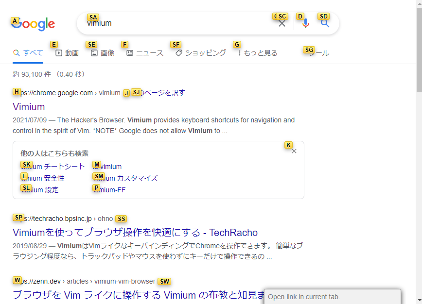
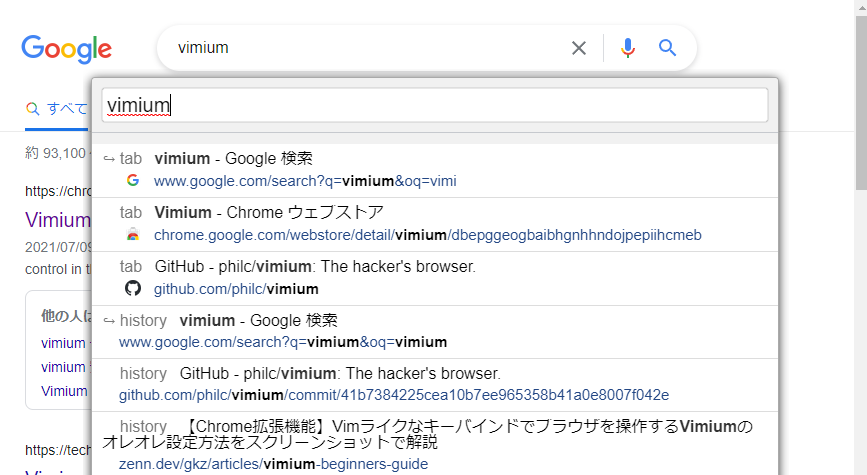
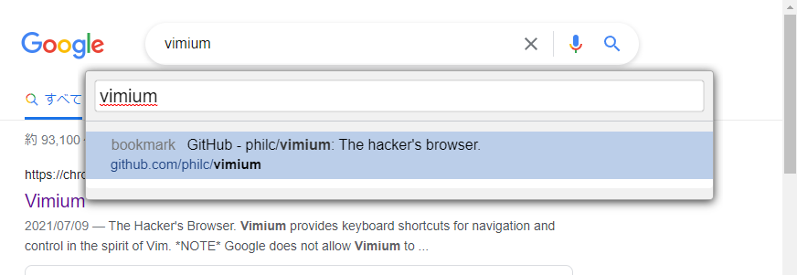
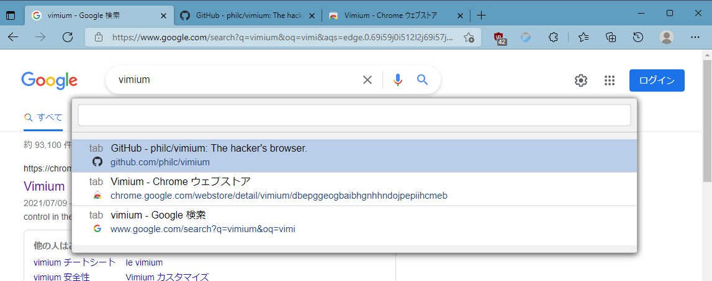

## vimiumって？

皆さん、vimiumを知っていますか？

vimiumはテキストエディタvimのキーバインドでブラウザを操作できるブラウザアドオンです。キーボードでブラウザを操作できるのでキーボードからマウスへ手を動かすという手間を減らすことができます。

vimといえばエディタ戦争で有名で何かと敷居が高いと感じるかもしれません。

しかし、vimについてよく知ってなかった私でも使ってて便利だと感じたので非vimmerの方にもオススメです。

ブラウザアドオンなので導入もストアから入手するだけなのでとっても簡単です。

## 便利だと思った機能

vimiumの詳細な使い方はググればいろいろな方が説明してくれています。

なのでここでは私が使ってみて便利だと思った、

- (f/F) リンクを開く
- (o/O) 履歴、ブックマークから検索してページを開く
- (b/B) 履歴、ブックマークから検索してページを開く
- (T) 現在開いてるタブの検索

について紹介していきます。

### (f/F) リンクを開く

開いているページ中でfキーを押すと次のような画面になります。

ここで表示されたアルファベットはクリックできる場所を表しており、アルファベットを入力すると対応したリンクを開くことができます。

Shiftキーを押しながらf（つまりF）キーを押した場合は新しいタブで開いてくれます。

### (o/O) 履歴、ブックマークから検索してページを開く

oキーを押すと検索ボックスみたいなのが出てきます。そこに文字をうっていくと履歴とブックマークから検索でき、開きたい検索結果を選択するとそのページを開けます。

これもShiftキーを押しながらo（つまりO）キーを押した場合は新しいタブで開いてくれます。

### (b/B) 履歴、ブックマークから検索してページを開く

o/Oキーとほぼ同じ。こっちはブックマークのみから検索してくれます。

### (T) 現在開いてるタブの検索

現在開いてるタブを一覧表示、検索できます。

## おわりに

このほかにもいろいろなキーバインドがあり、?キーを押すとヘルプを見ることができます。

また、<a href="https://github.com/philc/vimium">github</a>のreadmeを見てみるとヘルプにはのってないキーバインドがあったりします。慣れてきたら見てみると面白いかもしれません。

このvimiumをきっかけに本家vimのキーバインドに興味が出てくる人が出てくれると嬉しい限りです。（すでにVScodeを使っている人でもvimのキーバインドを使えるようにする拡張機能がありますよ）

それではよきvimライフを。